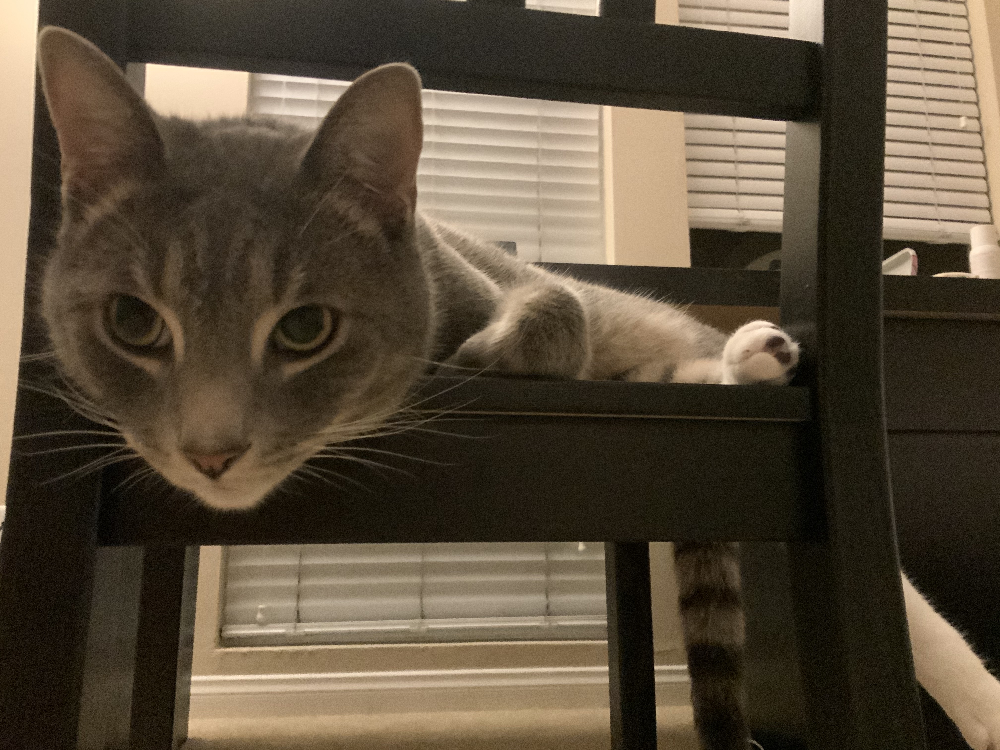
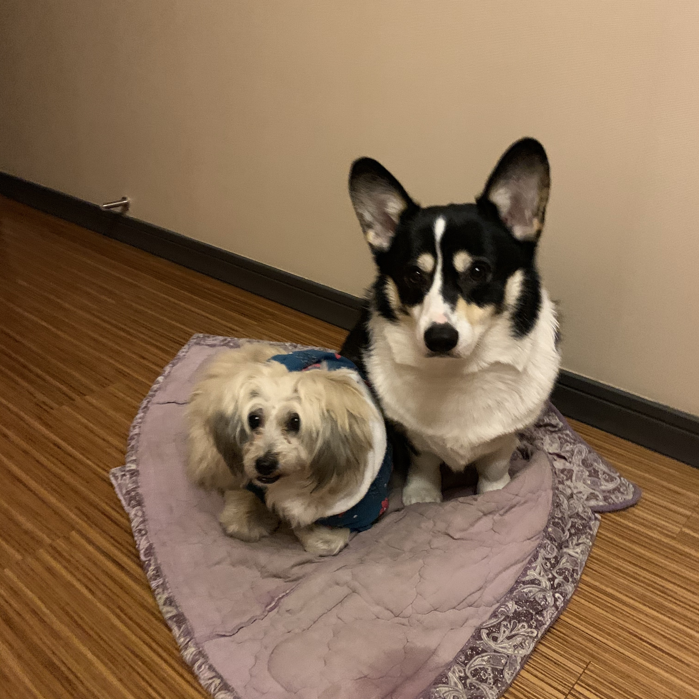

# All about ME

Two sections:
  - [a Programmer](#me-as-a-programmer)
  - [a Person](#me-as-a-person)

## Me as a Programmer

I am new to git, and I just learned git commands like `git branch` and `git checkout` in *cse110 lab 1*. I want to save [this great source](http://guides.beanstalkapp.com/version-control/common-git-commands.html) on git commands for future reference.

A todo for this lab:
- [x] Pictures
- [x] Headings
- [x] Styling text
- [x] Quoting text
- [x] Quoting code
- [x] Links
- [x] Section links
- [x] Relative links
- [x] Lists
- [x] Task lists

## Me as a Person
My name is **Chang**, and I am a graduating senior in CSE specialize in Bioinfo.  

My quote today is: 
> Happiness is the only thing that multiplies when you share it.

My weekend plan:
1. Finish all lectures
   - 6 classes
2. Pack
3. Go to the beach

Lastly, pictures of my dogs and cat using relative link:

